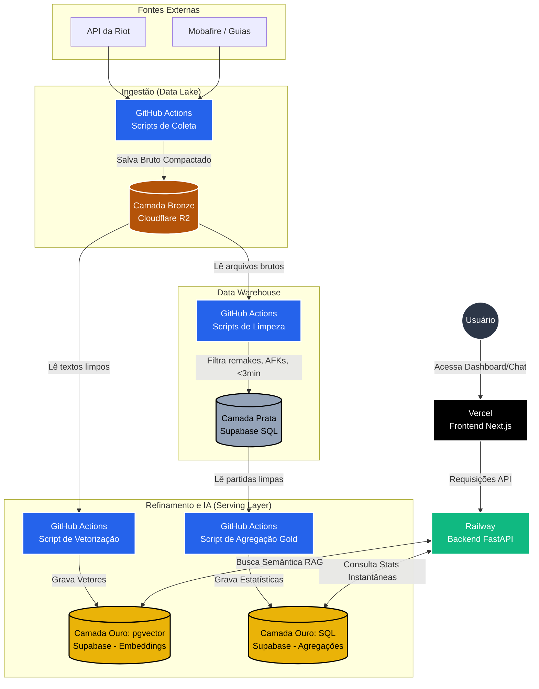

# Diagrama de Dados do projeto Metis

Breve descrição:

- Objetivo: representar entidades e relacionamentos principais do Metis.
- Local de referência: pasta `notes/00 - Visao_Geral_e_Arquitetura`.
