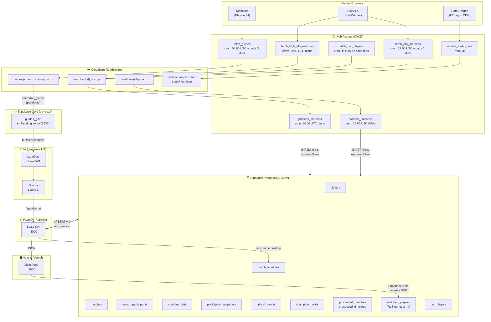
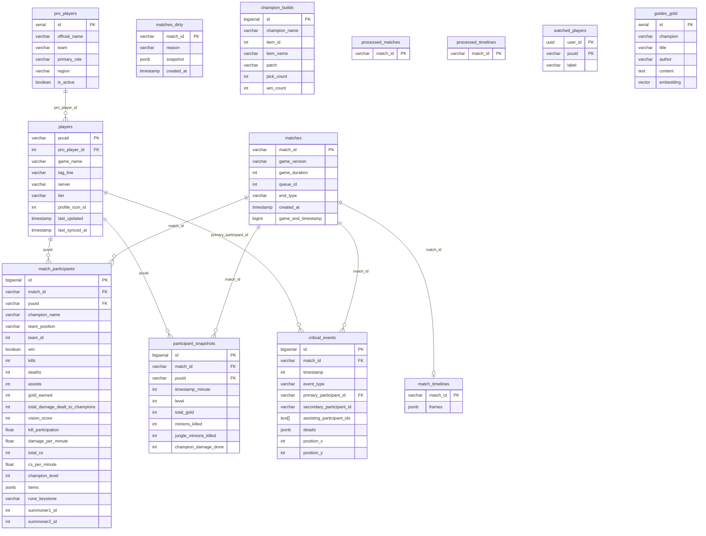
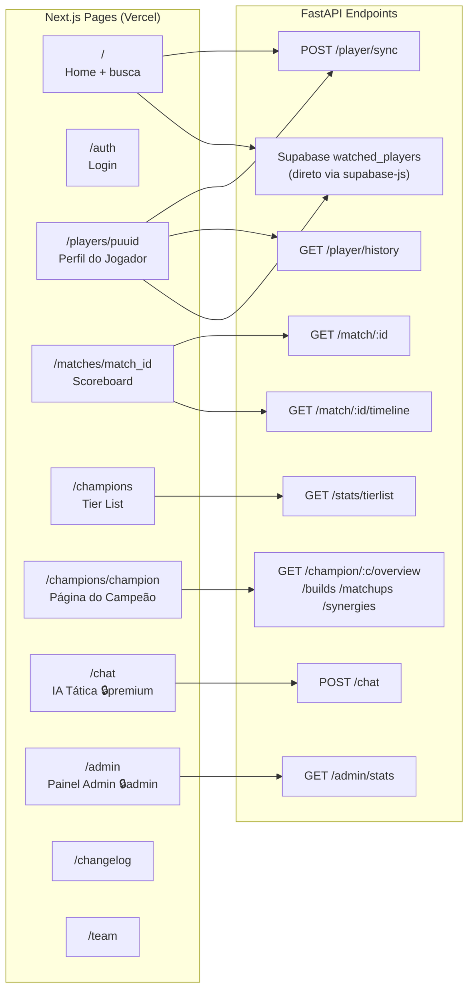

# Diagrama do Sistema — Metis
*Última atualização: 2026-04-04 — v0.7.2*

---

## 1. Arquitetura Geral (Fluxo de Dados)



---

## 2. Banco de Dados — Tabelas e Relacionamentos



### Views SQL
| View | Tabela base | Calcula |
|------|------------|---------|
| `champion_item_stats` | `champion_builds` | `winrate_pct = win_count / pick_count` |

### Tabelas de controle ETL (Bronze → Silver)
| Tabela | Uso |
|--------|-----|
| `processed_matches` | Idempotência — evita reprocessar match já inserido |
| `processed_timelines` | Idempotência — evita reprocessar timeline já inserida |

---

## 3. API Endpoints — FastAPI (Railway)

### Player `/api/v1/player`
| Método | Rota | Auth | Descrição |
|--------|------|------|-----------|
| POST | `/update-history` | — | Busca PUUID + sincroniza N partidas do jogador via Riot API |
| POST | `/sync` | — | Alias de update-history, recebe `riot_id = Nome#Tag` |
| GET | `/history` | — | Histórico paginado (`?puuid&limit&offset`) — retorna `has_more` |

### Match `/api/v1/match`
| Método | Rota | Auth | Descrição |
|--------|------|------|-----------|
| GET | `/{match_id}` | — | Scoreboard completo (blue_team, red_team, max_damage, has_timeline) |
| GET | `/{match_id}/timeline` | — | Frames CS/m, Gold, XP por minuto — cache hit em `match_timelines`, miss chama Riot API |

### Stats `/api/v1/stats`
| Método | Rota | Auth | Descrição |
|--------|------|------|-----------|
| GET | `/champions` | — | Stats médias de um campeão (`?champion&role&server&patch&min_matches`) |
| GET | `/tierlist` | — | Todos os campeões ordenados por winrate (`?role&server&patch&min_matches`) |

### Champion `/api/v1/champion`
| Método | Rota | Auth | Descrição |
|--------|------|------|-----------|
| GET | `/{champion}/overview` | — | Winrate, KDA, DPM, CS/m, KP, gold (`?role&server&patch&min_matches`) |
| GET | `/{champion}/builds` | — | Itens mais frequentes com winrate (via view `champion_item_stats`) |
| GET | `/{champion}/matchups` | — | Winrate contra cada oponente na mesma lane |
| GET | `/{champion}/synergies` | — | Winrate com aliados na mesma partida |

### Admin `/api/v1/admin`
| Método | Rota | Auth | Descrição |
|--------|------|------|-----------|
| GET | `/stats` | `Bearer JWT` + `is_admin=true` | Contagens do sistema — players, matches, dirty, timelines, syncs 24h/7d |

### Root
| Método | Rota | Auth | Descrição |
|--------|------|------|-----------|
| GET | `/api/v1/health` | — | `{"status":"online","system":"Metis"}` |
| POST | `/api/v1/ingestion/fetch-matches` | — | Dispara ingestão Bronze via API (R2) |
| POST | `/api/v1/chat` | — | **Skeleton** — aguarda integração Llama 3 + OpenRAG |

---

## 4. Frontend — Páginas e Dependências de API



### Modelo de Acesso
| Rota | Anon | Login | Login + Premium | Admin |
|------|:----:|:-----:|:---------------:|:-----:|
| `/` | ✅ | ✅ | ✅ | ✅ |
| `/auth` | ✅ | → `/` | → `/` | → `/` |
| `/players/[puuid]` | ✅ | ✅ | ✅ | ✅ |
| `/matches/[match_id]` | ✅ | ✅ | ✅ | ✅ |
| `/champions` | ✅ | ✅ | ✅ | ✅ |
| `/champions/[champion]` | ✅ | ✅ | ✅ | ✅ |
| `/changelog` + `/team` | ✅ | ✅ | ✅ | ✅ |
| `/chat` | ❌ | gate premium | ✅ | ✅ |
| `/admin` | ❌ | ❌ | ❌ | ✅ |

---

## 5. GitHub Actions — Workflows e Agendamento

```mermaid
gantt
    title GitHub Actions — Janela Diária (UTC)
    dateFormat HH:mm
    axisFormat %H:%M

    section Ingestão Bronze
    fetch_high_elo_matches (diário)   : 03:00, 5h40m
    fetch_pro_matches (2 em 2 dias)   : 22:00, 2h

    section Processamento Silver
    process_matches (diário)          : 14:00, 1h
    process_timelines (diário)        : 15:00, 1h
```



| Workflow | Cron (UTC) | Timeout | Script |
|----------|-----------|---------|--------|
| `fetch_high_elo_matches` | `0 3 * * *` — diário | 280 min | `scripts/ingestion/fetch_high_elo_matches.py` |
| `fetch_pro_players` | `0 4 1,15 * *` — quinzenal | — | `scripts/ingestion/fetch_pro_players.py` |
| `fetch_pro_matches` | `0 22 */2 * *` — a cada 2 dias | — | `scripts/ingestion/fetch_pro_matches.py` |
| `fetch_guides` | `0 4 */3 * *` — a cada 3 dias | 240 min | `scripts/ingestion/fetch_guides.py` |
| `process_matches` | `0 14 * * *` — diário | 60 min | `scripts/processing/process_matches.py` |
| `process_timelines` | `0 15 * * *` — diário | 60 min | `scripts/processing/process_timelines.py` |

### Secrets necessários no GitHub
| Secret | Usado por |
|--------|-----------|
| `RIOT_API_KEY` | fetch_high_elo, fetch_pro_matches |
| `SUPABASE_URL` | process_matches, process_timelines |
| `SUPABASE_KEY` | process_matches, process_timelines |
| `R2_ACCOUNT_ID` | todos os workflows |
| `R2_ACCESS_KEY_ID` | todos os workflows |
| `R2_SECRET_ACCESS_KEY` | todos os workflows |

---

## 6. Cloudflare R2 — Estrutura de Pastas (Bronze)

```
metis/                          ← bucket
├── matches/
│   └── BR1_3225XXXXXX.json.gz  ← JSON bruto da Riot API (match)
├── timelines/
│   └── BR1_3225XXXXXX.json.gz  ← JSON bruto da Riot API (timeline)
├── guides/
│   └── ahri_peng04.json.gz     ← Guia scrapeado do Mobafire
└── (static data gerenciado localmente em data/static/)
```

---

## 7. Eventos Capturados em critical_events

| `event_type` | `primary_participant_id` | `secondary_participant_id` | `assisting_participant_ids` | `details` |
|---|---|---|---|---|
| `CHAMPION_KILL` | PUUID do killer | PUUID da vítima | Array de PUUIDs | `null` |
| `ELITE_MONSTER_KILL` | PUUID do killer | `null` | `null` | `{monsterType, monsterSubType}` |
| `BUILDING_KILL` | PUUID do killer | `null` | `null` | `{buildingType, laneType, towerType, teamId}` |

---

## 8. Serviços e Tecnologias

| Serviço | Tecnologia | Onde |
|---------|-----------|------|
| Frontend | Next.js 15 + React 19 + Tailwind CSS v3 | Vercel |
| Backend API | FastAPI (Python 3.12) + Pydantic | Railway (Docker) |
| Banco Estruturado | PostgreSQL 17 | Supabase |
| Busca Vetorial | pgvector (nativo Supabase) | Supabase |
| RAG Orchestration | OpenRAG (Langflow + Docling) | pendente M4 |
| LLM | Llama 3 via Ollama | pendente M4 |
| Data Lake | Cloudflare R2 (S3-compatible) | Cloudflare |
| Auth | Supabase Auth (email/senha) + SSR cookies | Supabase |
| Scraper | Playwright + BeautifulSoup | GitHub Actions |
| Processamento | Python Polars | GitHub Actions |
| CI/CD | GitHub Actions | GitHub |
